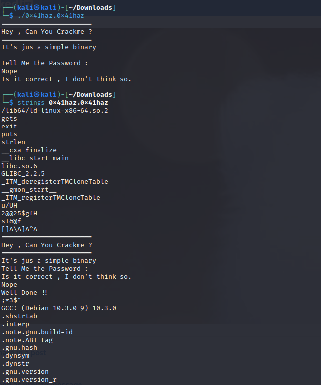

# 0x41haz - Reverse Challenge writeup

0x41haz.0x41haz Binary

Quando conseguimos um binário para fazer reverse, a primeira tarefa e a mais comum é digitar o comando strings 

Como Vimos acima, temos 2 strings separadas. Nesse caso vamos tentar ler os bytes dessas strings e temos 2@@25$gf - sT&@.

Para não perder a graça deixo uma dica - Veja o código com Decompile 

