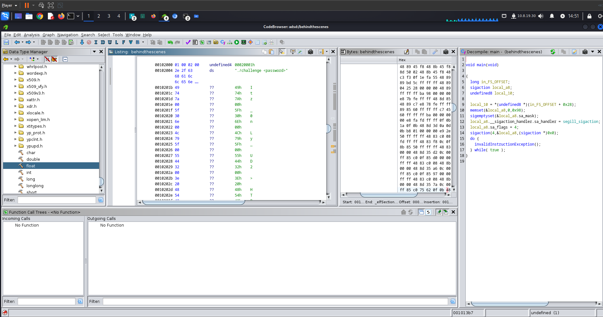

# Behind the Scenes - HTB write-up

Primeiro, fazemos o download do executável.

Em seguida, colocamos o executável na ferramenta Ghidra para analisar o decompilado do binário.

Ao analisar a função principal, podemos observar a senha em caracteres de bytes únicos. Cada byte representa uma parte da senha e, ao juntar todos os bytes com uma concatenação básica, obtemos a senha e capturamos a flag.

