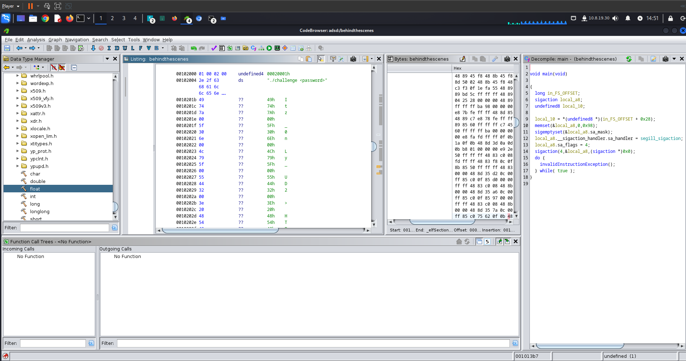

# Behind the Scenes - HTB write-up

Primeiro fazemos download do executavel.

Colocamos ele na ferramenta ghydra para analisar o decompile do binário.

Olhando a função principal, já temos a visão da senha em chars de bytes unicos. Cada byte forma uma parte da senha e unindo todos os bytes
com uma concatenação basica temos a senha e caputuramos a flag.
