# TheValley - THM Challenge writeup

Primeiro fazemos um port scan rápido para identificar serviços abertos no ip da máquina.

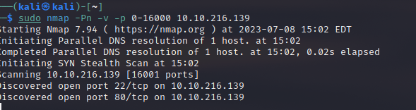

Temos uma porta 80 padrão com um serviço HTTP padrão e uma porta 22 ssh também padrão. Então acessamos o site e nos deparamos com um botão que redireciona a gente para o link da galleria de imagens.

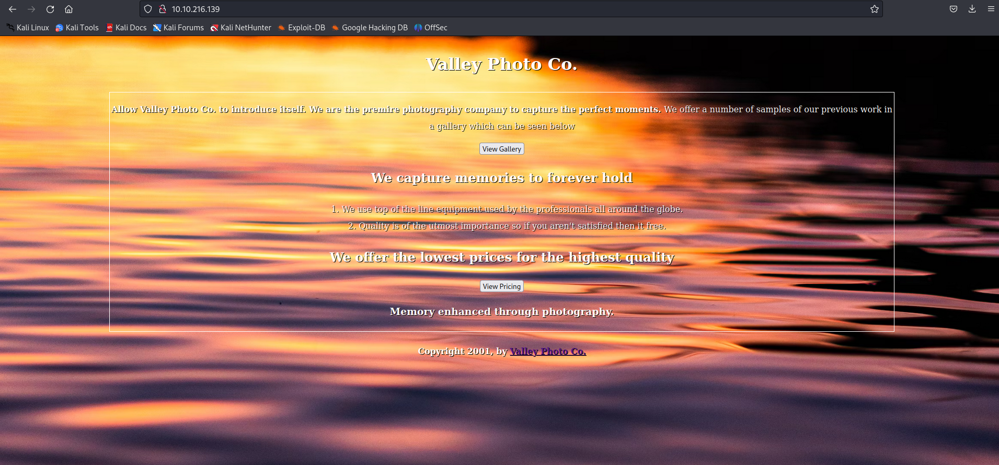

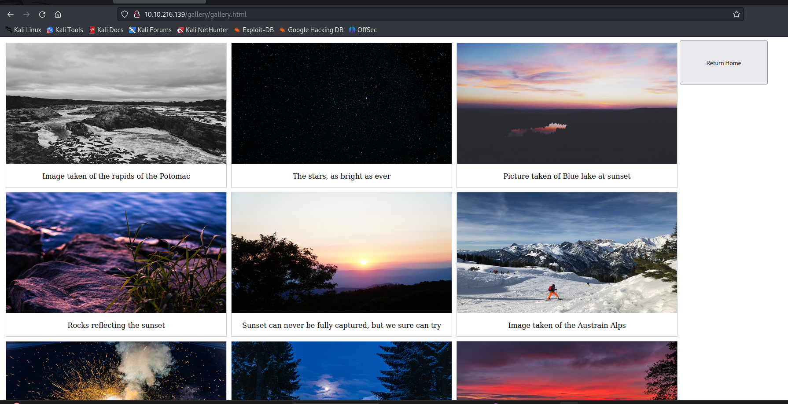

Entramos em uma imagem e temos uma pasta de arquivos estáticos.

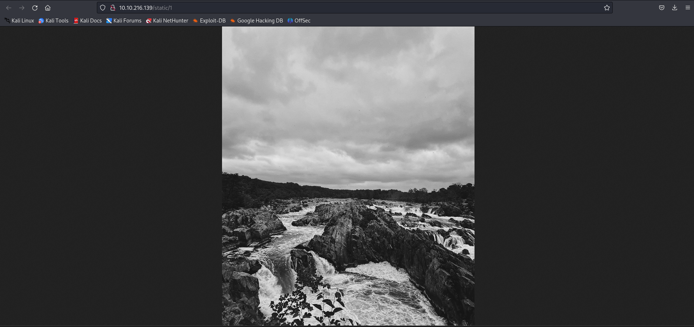

Quando falamos em arquivos redirecionados por numeros de Get params pensamos primeiramente em IDOR. Então vamos tentar buscar por caminhos entre esses números de arquivos.


```ffuf -w <wordlist> -u http://<url>/static/FUZZ -mc 200```

ffuf é uma ferramente de fuzzing de URL e esse comando filtra os resultados encontrados baseados em request status code. No caso acima só temos retorno 200, isso evitara que erros 404, 401, 403 apareçam no output das nossa solicitações.


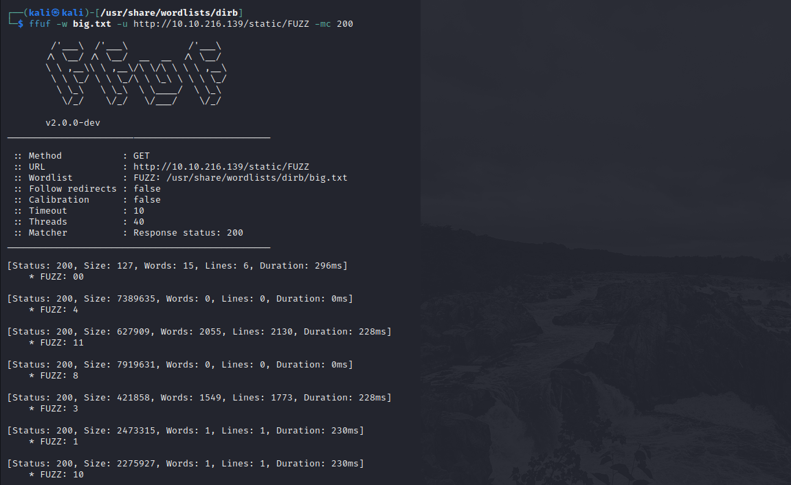

Algo estranho aconteceu. Todos o numeros são de um unico numero e o primeiro zero possui dois zeros, então vamos investigar.


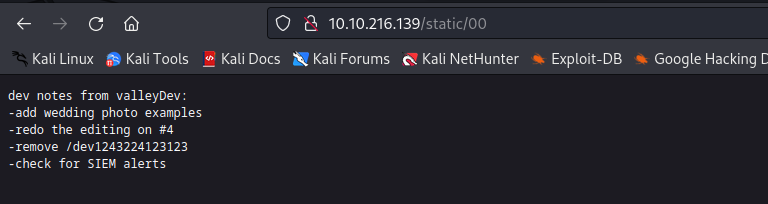

Um caminho de url um pouco estranho, vamos colocar no navegador e ver as respostas.

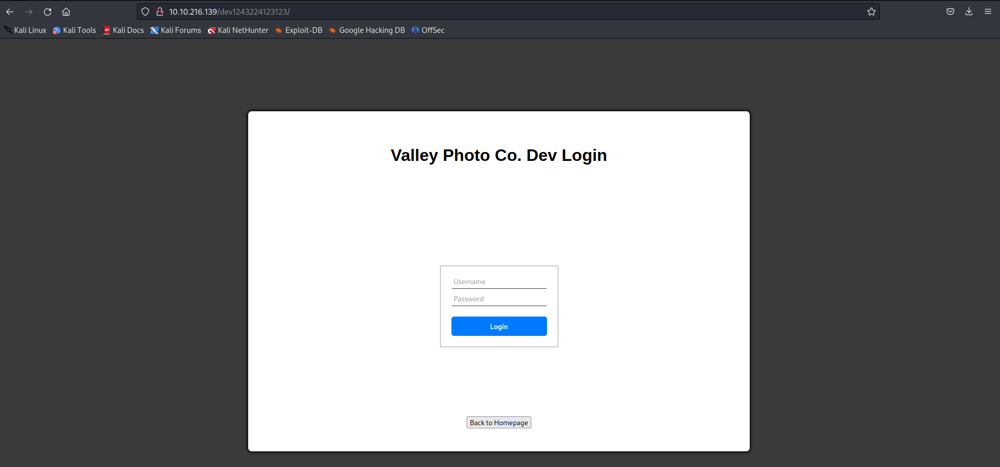

Certo uma tela de login, na primeira hipotese de uma tela de login olhamos por buscas Client Side por ser a forma mais "Simples" e rápida de achar um username e talvez tentar partir disso.

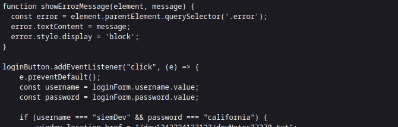

O login está sendo validado em Client side e isso mostra credenciais e conseguimos realizar o login.

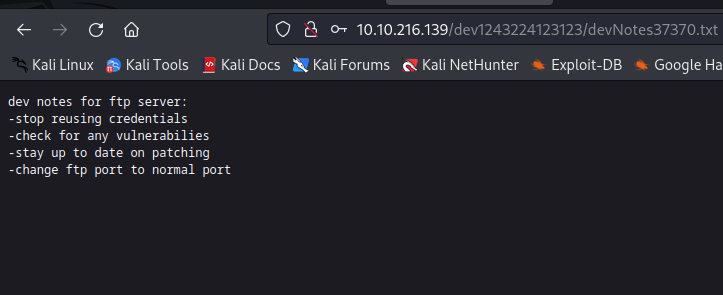

Aqui diz que existe um serviço FTP rodando, mas o nosso portscan não retornou essa porta. Vamos refazar o portscan adicionando um range de porta maior

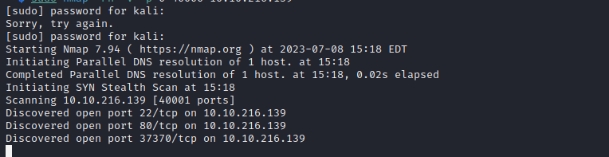

Uma porta 37370 um tanto quanto diferente pra um serviço FTP. Quando pensamos em situações com login FTP, pensamos primeiramente em login anonymous;anonymous então vamos tentar.

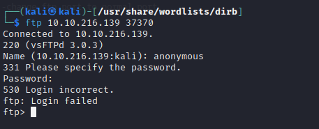

Falhamos mas está escrito na url indicada pra não repetir senhas, então vamos tentar ftp com a senha de login da página web.

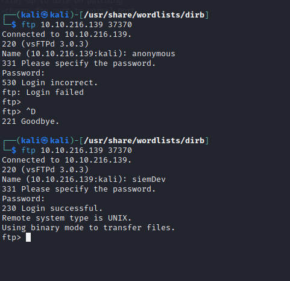

Conseguimos entrar no FTP, agora vamos escalar pra possiveis arquivos indicadores.


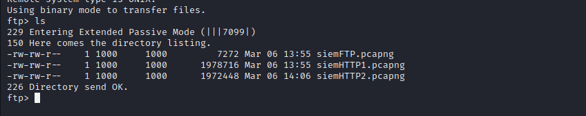

Achamos 3 arquivos. Dentro de uma conexão FTP, não conseguimos ler arquivos então usamos o comando ```get``` que faz um download dos arquivos para a pasta raiz do nosso S.O


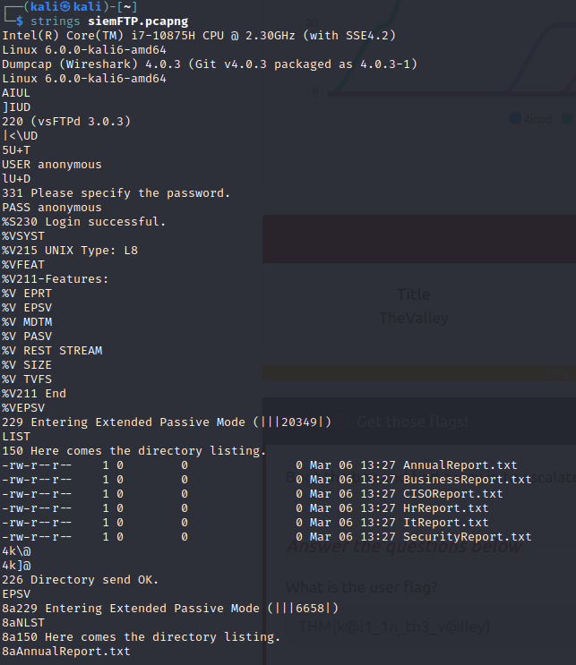

Os arquivos são binários de pacotes de rede que podem ser lidos por wireshark. Como queremos informações, análisar pacotes usando wireshark e na retornando a url pós login, dizia pra não repetir credenciais. Temos motivos pra achar que esses arquivos pncap possuem credenciais. 

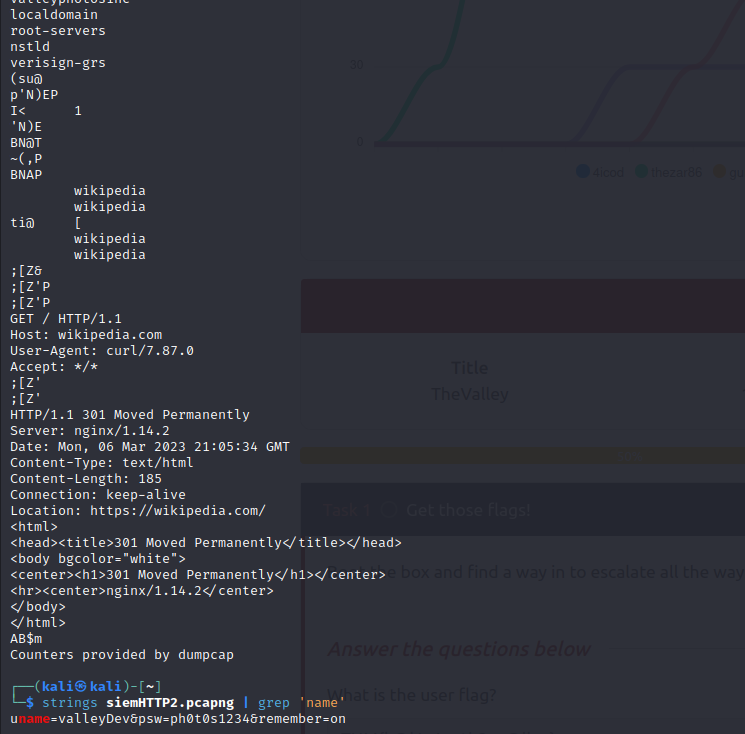

Vamos voltar do inicio, temos também uma porta 22 com ssh aberta. Os desenvolvedores, quando acessam plataformas em deploy e precisam realizar alterações em código ou em arquivos de gerenciamento acessam o ssh da máquina que está hospedando. Então tentaremos acessar o SSH usando esse login


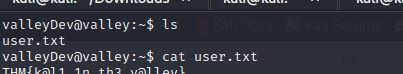


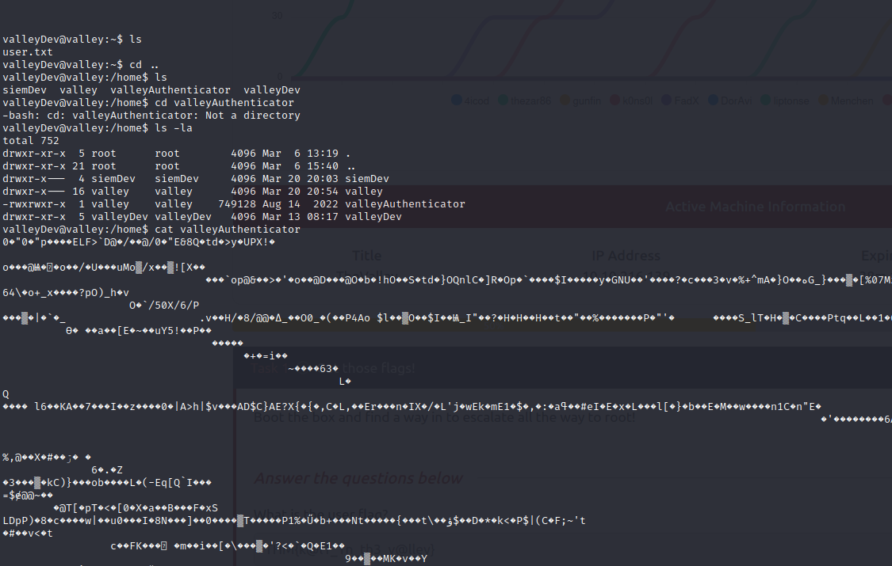

Pra escalar para o usuário valley, encontramos um arquivo valleyAuthenticator. Tive a ideia genial de tentar ler o conteúdo de um binário e loopou. Vamos tentar ler o conteúdo do binário usando o mesmo comando que usamos pra ler os arquivos pncap.

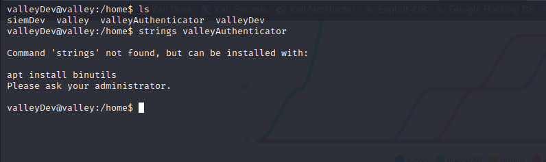

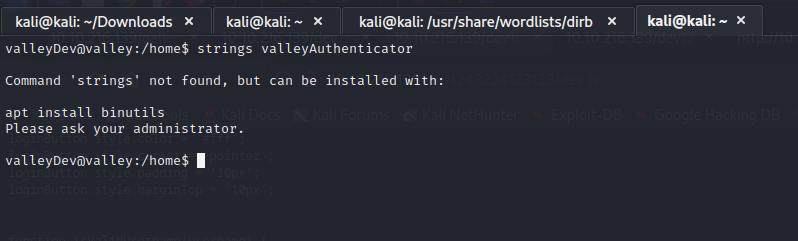

O comando não está disponível, não conseguimos acessar outras pastas então unica saída é esse arquivo. Precisamos fazer o download dele em nosso S.O usando um server http python simples.

``` python -m http.server 8080 ```

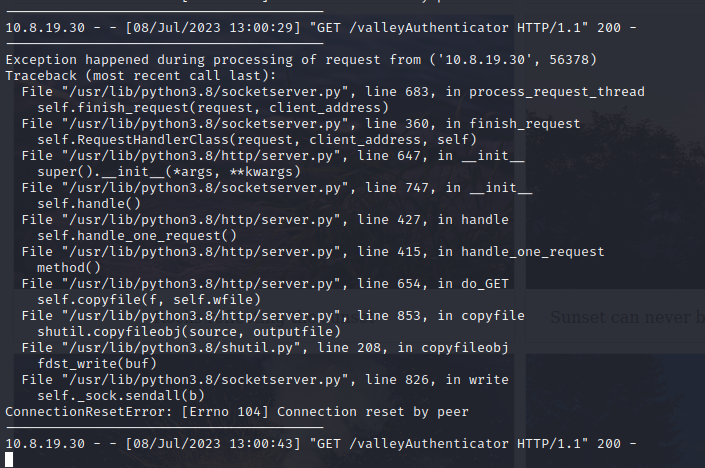

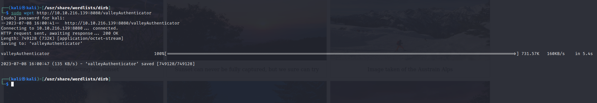

Agora conseguimos usar o comando strings no nosso S.O.

```
e6722920bab2326f8217e4bf6b1b58ac
dd2921cc76ee3abfd2beb60709056cfb
```
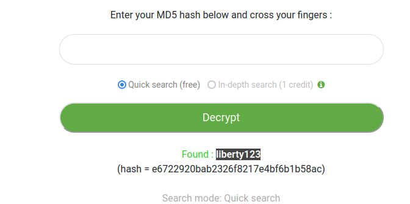
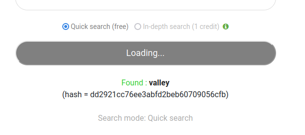

Esses 2 hashes md5 podem ser a senha do authenticator. Vamos fazer o login do user valley que conseguimos ver na pasta ~/home usando essa nova credencial SSH.

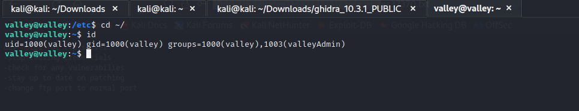

Agora que conseguimos acessar o usuário, queremos o usuário root da máquina. Procuramos por arquivos com permissão de escrita que pode ser executado como root usando o comando ``` find -l / -perm -4000 2>/dev/null```

Estamos procurando por um arquivo com permissão -4000 setuid em todo o S.O partindo do diretório principal / e retirando os output de erro com o 2>/dev/null.

Não tivemos retorno, então vamos adptar o comando.

```find / -writable  2>/dev/null```

Vamos em movimento lateral, procurando por coisas que podemos usar para escalar. 

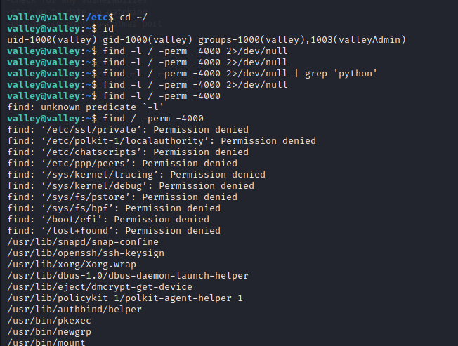
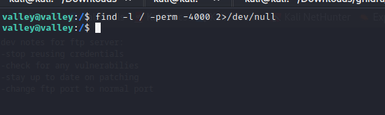

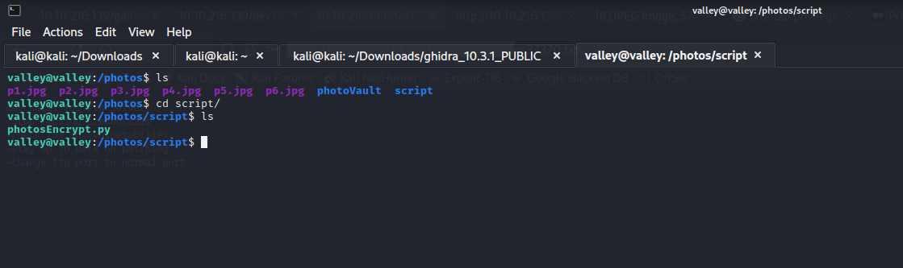
Agora sabemos que a máquina tem python instalado e podemos filtrar o retorno da nossa busca.

```find / -writable  2>/dev/null | grep 'python'``` 

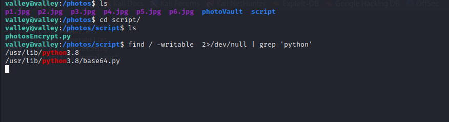

Agora voltamos ao diretorio Photos em que temos a permissão de valleyAdmin para executar o arquivo python e acessar o root


importamos a lib os do python e executamos um bash command porém diferente das revShells que colocamos o ip da máquina como escopo, dessa vez colocamos o ip do THM. Isso vai permitir que ao abrir a porta com netcat, conseguimos nos conectar com o root.


Tempo de conclusão da máquina: 8 horas.

